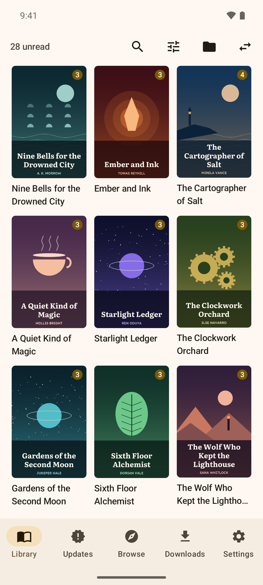
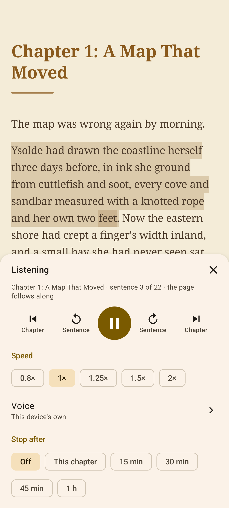
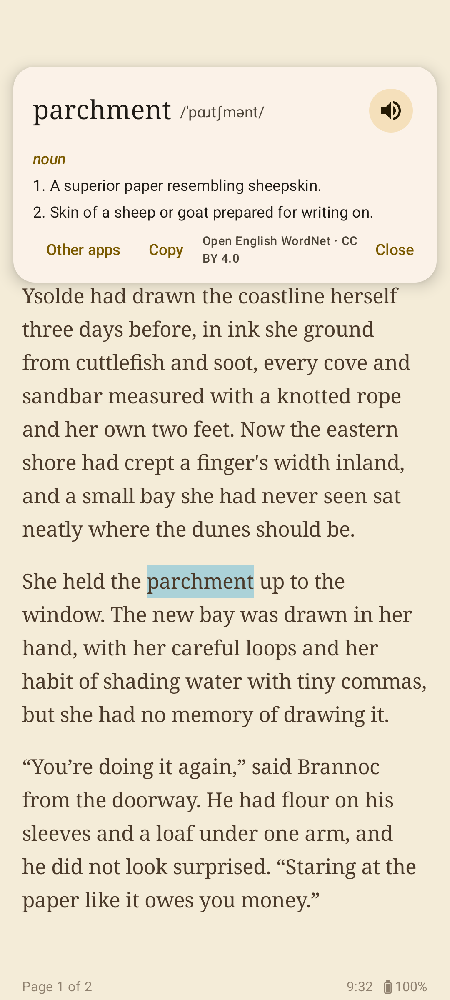

<!-- download:start (release.sh rewrites this block with each public release) -->

  

  <b>Fanos 0.1.4</b> · 23 MB · Android 8.0 or later (64-bit) 
  Tap the button, then open the downloaded file to install it. Your browser may ask you to allow installing apps first. 
  <a href="https://github.com/nimbice/fanos/releases">All releases</a> · <a href="CHANGELOG.md">What's new</a>

  

<!-- download:end -->

# Fanos

Fanos (φανός, Greek for a lantern) is an Android reader for web novels: a library of novels, checked for new
chapters in the background with a notification when some arrive, search across the sites, downloads for offline
reading, a reader with scroll and page modes, listening with the device's voices or natural ones read offline, a
built-in dictionary, highlights, notes and reading stats. A ground-up rebuild of
[NovelLibrary](https://github.com/gmathi/NovelLibrary) that takes the great work done on the original project and
combines it with a more modern interface.

  
  
  
  

The books shown are made up for these pictures.

Fanos comes with no sources. Each site is an extension, built in [a repository of its own](https://github.com/nimbice/fanos-extensions).
Browse > Extensions lists the published ones (Royal Road, Scribble Hub, Novel Updates and Patreon) and installs
them, or any extension from a file; Fanos checks who signed it and asks before trusting a new key.

See [docs/architecture.md](docs/architecture.md) for how it is put together.

## About the sites

Fanos hosts, copies and shares no novels. It reads a site's chapter the way a browser's reader mode does, showing
you just the text, and keeps downloads on your device for reading offline. It shows what the site shows you: it
unlocks nothing you haven't got access to yourself, and it never answers a site's security check for you (you
complete it yourself, in the built-in browser). Fanos is an independent project: it is not affiliated with or
endorsed by any site, publisher or company, including any other business or product called Fanos. Read within
each site's terms, and support the authors and translators whose work you enjoy.

## Privacy

Fanos collects nothing and has no analytics. It connects to:

- the sites you read, through the extensions you install (they see the device's browser);
- GitHub, to look for app updates and to fetch the natural-voice pack when you ask for it;
- dictionaryapi.dev and Wiktionary, for words the built-in dictionary hasn't got (Settings > Reader > Look up
  missing words online turns that off);
- Open Library, when you search for a book's cover;
- a site's reading list, only if you turn its sync on in Settings > Reading lists.

Your library, reading places, highlights and notes stay on your device, and in the backups you make
(Settings > Backup). Signing in to a site happens in the built-in browser; its cookies stay on the device.

## Installing and updates

Download `Fanos-<version>.apk` from the [releases](https://github.com/nimbice/fanos/releases) (arm64 devices, Android 8.0
or later) and open it to install. From then on Fanos checks for a newer release once a day
(Settings > Updates, where it can be turned off), tells you when there is one, and installs it only when you ask.
A build is installed only if it was signed with the same key as the app you have.

## Building

JDK 17 and the Android SDK with platform 37.2 (Android 17).

    ./gradlew assembleDebug        # the app
    ./gradlew test                 # unit tests (content extraction, data layer, reader)
    ./gradlew :source:api:publishToMavenLocal   # the source API, for building extensions

Builds are stamped with `-PbuildVersionCode=N -PbuildVersionSuffix=-test.N -PbuildAbi=arm64-v8a`.

Extensions load into Fanos's own process and build against its source API (GPL-3.0-or-later), so an extension
must be under the GPL or a licence compatible with it.

## License

[GPL-3.0-or-later](LICENSE). Includes code derived from NovelLibrary (Apache-2.0). The seven reading fonts keep
their own licence, the SIL Open Font License 1.1; the built-in dictionary is made from Open English WordNet
(CC BY 4.0); the speech engine sherpa-onnx (Apache-2.0) has ONNX Runtime (MIT) and eSpeak NG (GPL-3.0-or-later)
built into it. See [NOTICE](NOTICE) and [THIRD_PARTY_NOTICES.md](THIRD_PARTY_NOTICES.md), which also ship inside
the app under Settings > About.
